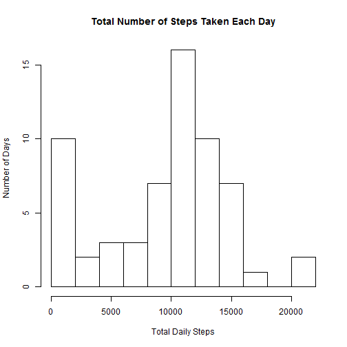
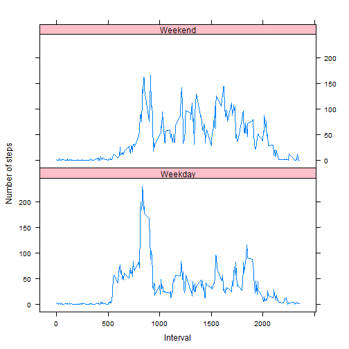

---
title: "Reproducible Research: Peer Assessment 1"
output: 
  html_document:
    keep_md: true
---    

## Loading and preprocessing the data

Attach packages and set working directory


```r
library(dplyr)
library(lubridate)
library(knitr)
library(lattice)

setwd('~/Cousera/Reproducible Research/RepData_PeerAssessment1')
```

Unzip and read the data


```r
unzip("activity.zip")
data <- read.csv("activity.csv", stringsAsFactors=FALSE, na.strings="NA")
```

Calculate the total number of steps per day and the mean and median total number of steps per day using the summarise function.  


```r
total <- as.data.frame(summarise(group_by(data, date), 
                                 steps=sum(steps, na.rm=TRUE)))

stats <- summarize(total, Mean=mean(steps, na.rm=TRUE),
                          Median=median(steps, na.rm=TRUE))
```

Also, create a datetime variable formated as POSIXct for the time series plot.


```r
data$datetime <- as.POSIXct(data$date, format="%Y-%m-%d") + minutes(data$interval)
```


## What is mean total number of steps taken per day?

For this part of the assignment, you can ignore the missing values in the dataset.

1. Make a histogram of the total number of steps taken each day 


```r
hist <- hist(total$steps, breaks=12,
             xlab="Total Daily Steps",
             ylab="Number of Days",
             main="Total Number of Steps Taken Each Day")
```

 

2. Calculate and report the mean and median total number of steps taken per day

*The mean total number of daily steps is 9354 and the median number of daily steps is 10395.*


## What is the average daily activity pattern?

1. Make a time series plot (i.e. type = "l") of the 5-minute interval (x-axis)
and the average number of steps taken, averaged across all days (y-axis)

Calculate the average number of steps taken, averaged across all days and store in data frame.


```r
time <- as.data.frame(summarise(group_by(data, interval), Mean=mean(steps, na.rm=TRUE)))

plot(time$interval, time$Mean, type="l", xlab="Minutes",
     ylab="Average Number of Steps Taken (Average Over Days)")
```

 


2. Which 5-minute interval, on average across all the days in the dataset,
contains the maximum number of steps?


```r
max <- filter(time, Mean==max(time$Mean))
```

*The 835 minute interval has an average of 206 steps, the maximum average number of steps.*


## Imputing missing values

Note that there are a number of days/intervals where there are missing values
(coded as NA). The presence of missing days may introduce bias into some
calculations or summaries of the data.

1. Calculate and report the total number of missing values in the dataset
(i.e. the total number of rows with NAs)
2. Devise a strategy for filling in all of the missing values in the dataset. The
strategy does not need to be sophisticated. For example, you could use
the mean/median for that day, or the mean for that 5-minute interval, etc.
3. Create a new dataset that is equal to the original dataset but with the
missing data filled in.
4. Make a histogram of the total number of steps taken each day and Calculate
and report the mean and median total number of steps taken per day. Do
these values differ from the estimates from the first part of the assignment?
What is the impact of imputing missing data on the estimates of the total
daily number of steps?

Count Missing values in data


```r
miss <- as.numeric(sum(is.na(data$steps)))
```

*There are a total of 2304 missing values in the dataset.*\n

The 5 minute interval mean will be used to impute missing values in the original dataset.  Merge the means by time data with the original data. If the original steps data is missing then replace it with the interval mean.  Rerun the above code using the Imputed dataset to answer part 4.


```r
dataimp <- merge(data, time, by="interval", all.x=TRUE)
dataimp$steps <- ifelse(is.na(dataimp$steps), dataimp$Mean, dataimp$steps)

totalimp <- as.data.frame(summarise(group_by(dataimp, date), 
                                    steps=sum(steps)))

statsimp <- summarize(totalimp, Mean=mean(steps),
                                Median=median(steps))

histimp <- hist(totalimp$steps, breaks=12,
                xlab="Total Daily Steps",
                ylab="Number of Days",
                main="Total Number of Steps Taken Each Day\n (Imputed Data)")
```

 

*The mean and median number of steps without imputation was 9354 and 10395, respectively, while the mean and median number of step with imputation was 10766 and 10766, respectively.*


## Are there differences in activity patterns between weekdays and weekends?

For this part the weekdays() function may be of some help here. Use the dataset
with the filled-in missing values for this part.

1. Create a new factor variable in the dataset with two levels - "weekday"
and "weekend" indicating whether a given date is a weekday or weekend
day.


```r
dataimp$wday <- wday(dataimp$date, label=TRUE, abbr=FALSE)
dataimp$weekend <- as.factor(ifelse(dataimp$wday=="Saturday" | dataimp$wday=="Sunday",
                              "Weekend", "Weekday"))
```


2. Make a panel plot containing a time series plot (i.e. type = "l") of the
5-minute interval (x-axis) and the average number of steps taken, averaged
across all weekday days or weekend days (y-axis).


```r
time2 <- as.data.frame(summarise(group_by(dataimp, interval, weekend),
                                 Mean=mean(steps)))

xyplot(Mean ~ interval | weekend, data=time2, 
       layout=c(1,2), type="l",
       strip=strip.custom(bg="pink"),
       xlab="Interval", ylab="Number of steps")
```

 


*In general, there is less activity in the morning and more activity during the middle of the day on the weekends compared to the weekdays.*
